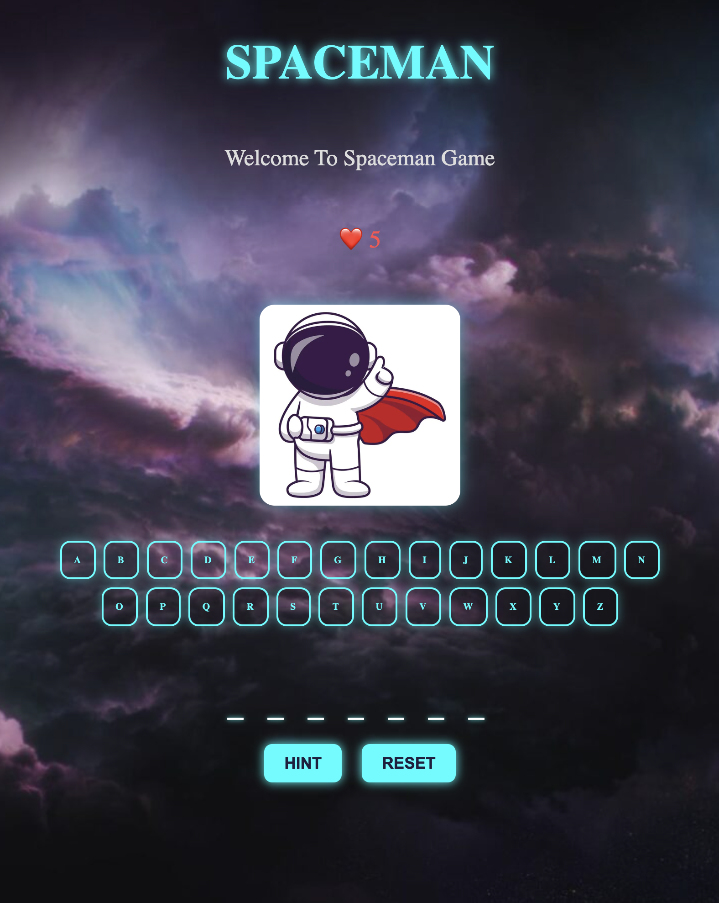
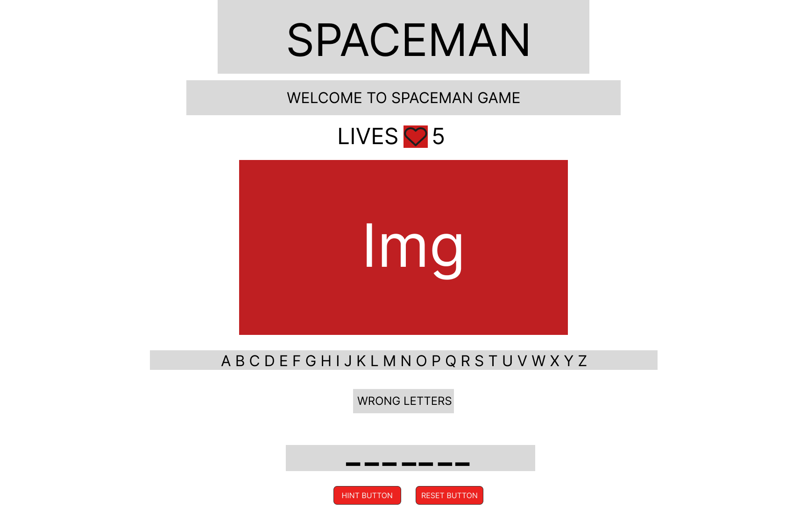

# Spaceman: Country Guessing Edition

## Description
Spaceman is a fun and interactive word-guessing game where players must uncover the name of a randomly chosen country — one letter at a time. With only **5 lives**, each wrong guess brings your brave space explorer closer to defeat.

## How It Works
* A random country name is selected from a predefined list.
* The player selects letters by clicking on an on-screen alphabet.
* Correct guesses reveal letters in the country name.
* Wrong guesses are tracked, and lives are reduced.
* Once lives reach 0, the game ends with a “Game Over” message.
* If all letters are correctly guessed, the player wins!

## Features
* **Hint Button**: Need help? Get a clue related to the country.
* **Reset Button**: Restart the game with a new country anytime.
* Wrong Letters Display: See your incorrect guesses in real time.
* Dynamic Lives Display: Shows remaining lives with heart emojis.
* Victory & Game Over Feedback: Visual cues tell you when you win or lose.

## Pseudocode

1. Initialize variables to manage game state, including wrong letters, correct letters and lives.
2. Store cached element references.
3. Show the current state of the game - lives, wrong and correct letters and underscores.
4. When the chosen letter is wrong decrease lives.
5. Define constants.
6. Handle a player clicking a letter using a  handleLetterClick function.
7. Create reset function.
8. Add a Hint feature
9. Show a result message when the word is guessed or when the  lives is 0

## Technologies Used
* HTML5
* CSS3
* JavaScript

## WireFrame

